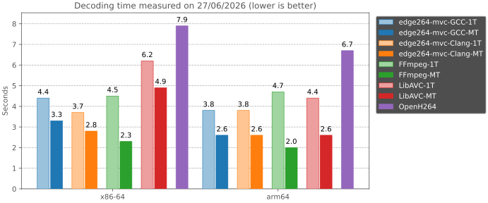

# edge264-mvc

edge264 is a cross-platform, open-source H.264/AVC **software** decoder, focused on **speed** and **ease of use**.

> [!NOTE]
> This is a maintained fork of [tvlabs/edge264](https://github.com/tvlabs/edge264), used
> in production by **[Oku3D Media Player](https://oku3d.com/)**, a native 3D media player. It
> makes the **MVC / H.264 Annex H decode path (3D Blu-ray, stereo)** actually work end to end:
> FFmpeg / libavcodec drop the MVC dependent view entirely, so this is the only viable
> open-source *software* MVC decoder, but stock edge264's MVC path had several bugs and the fixing PRs
> sat open for months. edge264-mvc integrates those PRs, adds many more MVC-correctness and
> real-world decode-robustness fixes, and implements working **multithreaded decoding** (bit-exact
> to single-thread and validated on the full 231-stream JVT conformance corpus).



*Benchmark computed as the fastest of 10 runs of [Big Buck Bunny test video](https://test-videos.co.uk/vids/bigbuckbunny/mp4/h264/1080/Big_Buck_Bunny_1080_10s_30MB.mp4),
on GitHub-hosted runners. Each decoder is timed both single-threaded (`1T`) and multithreaded
(`MT`, all auto-detected cores) for a fair comparison at both ends; OpenH264's decoder has no
multithreading, so it is shown once. All times are wall-clock - the MT speedup is bounded by the
runner's few vCPUs, so a many-core machine gains more.*


## Features

edge264 decodes the **Progressive High** and **Stereo High (MVC 3D)** profiles, up to level 6.2. Both the **MVC 3D** path and **multithreaded decoding** are fully functional here; stock edge264 ships the same code but both are broken (see [Relation to edge264](#relation-to-edge264)).

Below is an overview of optional features versus Baseline (**BP**), Extended (**XP**), Main (**MP**), High (**HP**) and Stereo High (**SHP**) profiles. Features outside the **Progressive High** and **Stereo High** scope (higher bit depths, 4:2:2/4:4:4 chroma, interlaced coding) are intentionally out of scope and well covered by general-purpose decoders such as FFmpeg; edge264's focus is the MVC 3D path that FFmpeg cannot decode.

| Feature | BP | XP | MP | HP | SHP | edge264 |
| --- | --- | --- | --- | --- | --- | --- |
| Bit depth | 8 | 8 | 8 | 8 | 8 | 8 |
| Chroma formats | 4:2:0 | 4:2:0 | 4:2:0 | 4:0:0<br/>4:2:0 | 4:0:0<br/>4:2:0 | 4:2:0 |
| Flexible macroblock ordering | ✓ | ✓ | | | | |
| Arbitrary slice ordering | ✓ | ✓ | | | | ✓ |
| Redundant slices | ✓ | ✓ | | | | |
| Data partitioning | | ✓ | | | | |
| SI/SP slices | | ✓ | | | | |
| Interlaced coding (PAFF, MBAFF) | | ✓ | ✓ | ✓ | ✓ | |
| B slices | | ✓ | ✓ | ✓ | ✓ | ✓ |
| CABAC entropy coding | | | ✓ | ✓ | ✓ | ✓ |
| 8x8 IDCT transforms | | | | ✓ | ✓ | ✓ |
| Custom quantization matrices | | | | ✓ | ✓ | ✓ |
| Separate Cb/Cr QP control | | | | ✓ | ✓ | ✓ |
| Separate color planes | | | | | | |
| Lossless coding | | | | | | |
| Max. number of views | 1 | 1 | 1 | 1 | 2 | 2 |


## Platforms

Target system support currently includes **macOS**, **Linux**, **Windows** and **WebAssembly**.

Processor support depends on the compiler used (GNU GCC or LLVM Clang). edge264 can choose among 4 backends, the last one supporting every other little-endian CPU by relying on [Clang vector extensions](https://clang.llvm.org/docs/LanguageExtensions.html#vectors-and-extended-vectors).

| Compiler | Intel x86/x64 | ARM32/64+NEON | WASM32/64 v2+ | Other ISAs |
|-|-|-|-|-|
| Clang | ✓ | ✓ | ✓ | ✓ (v15+) |
| GCC | ✓ | ✓ | | |


## Building

For native builds:

```sh
make
```

For WebAssembly builds:

```sh
emmake make OS=wasm
```

You can find lists of targets and options and what they do in the [Makefile](Makefile).

The `VARIANTS` option allows shipping multiple builds inside a single library file. It is intended for distribution packages that must run efficiently across a wide range of x86 CPUs: the library detects the host ISA level at runtime and dispatches to the fastest available implementation. They are *not* needed for a native single-machine build, where `-march=native` already picks the best code path at compile time. For example:

```sh
make CFLAGS="-march=x86-64" VARIANTS=x86-64-v2,x86-64-v3 BUILDTEST=no
```

### CMake integration

edge264 ships a `CMakeLists.txt` that wraps its Makefile, so you can
integrate it into a CMake project without writing any custom build logic.
It exposes a single imported target `edge264::edge264` for use with
`target_link_libraries`.

```cmake
cmake_minimum_required(VERSION 3.14)
project(my_app C)

include(FetchContent)
FetchContent_Declare(edge264
  GIT_REPOSITORY https://github.com/jens-duttke/edge264-mvc.git
  GIT_TAG        v2026.06.27  # always pin to a tag or commit hash
)
FetchContent_MakeAvailable(edge264)

add_executable(my_app main.c)
target_link_libraries(my_app PRIVATE edge264::edge264)
```


## Usage

```sh
make
./edge264_test --help # prints all options available
ffmpeg -i vid.mp4 -vcodec copy -bsf h264_mp4toannexb -an vid.264 # optional, converts from MP4 format
./edge264_test -d vid.264 # replace -d with -b to benchmark instead of display
```

Here is a complete example that opens an input file in Annex B byte stream format from the command line, and dumps its decoded frames in planar YUV order to standard output. See [edge264_test.c](src/edge264_test.c) for a more complete example which can also display frames.

```c
#include <fcntl.h>
#include <unistd.h>
#include <sys/mman.h>
#include <sys/stat.h>
#include <sys/types.h>

#include "edge264.h"

int main(int argc, char *argv[]) {
	int fd = open(argv[1], O_RDONLY);
	struct stat st;
	fstat(fd, &st);
	uint8_t *buf = mmap(NULL, st.st_size, PROT_READ, MAP_SHARED, fd, 0);
	const uint8_t *nal = buf + 3 + (buf[2] == 0); // skip the [0]001 delimiter
	const uint8_t *end = buf + st.st_size;
	// auto threads, no logs, auto allocs
	Edge264Decoder *dec = edge264_alloc(-1, NULL, NULL, 0, NULL, NULL, NULL);
	Edge264Frame frm;
	int res;
	do {
		const uint8_t *start_code = edge264_find_start_code(nal, end, 0);
		res = edge264_decode_NAL(dec, nal, start_code, NULL, NULL);
		while (!edge264_get_frame(dec, &frm, 0)) {
			for (int y = 0; y < frm.height_Y; y++)
				write(1, frm.samples[0] + y * frm.stride_Y, frm.width_Y);
			for (int y = 0; y < frm.height_C; y++)
				write(1, frm.samples[1] + y * frm.stride_C, frm.width_C);
			for (int y = 0; y < frm.height_C; y++)
				write(1, frm.samples[2] + y * frm.stride_C, frm.width_C);
		}
		if (res != ENOBUFS)
			nal = start_code + 3;
	} while (res == 0 || res == ENOBUFS);
	edge264_free(&dec);
	munmap(buf, st.st_size);
	close(fd);
	return 0;
}
```


## API reference

<code>const uint8_t * <b>edge264_find_start_code</b>(buf, end, four_byte)</code>

> Return a pointer to the next three or four byte (0)001 start code prefix, or `end` if not found.
> * `const uint8_t * buf` - first byte of buffer to search into
> * `const uint8_t * end` - first invalid byte past the buffer that stops the search
> * `int four_byte` - if 0 seek a 001 prefix, otherwise seek a 0001

<code>Edge264Decoder * <b>edge264_alloc</b>(n_threads, log_cb, log_arg, log_mbs, alloc_cb, free_cb, alloc_arg)</code>

> Allocate and initialize a decoding context.
> * `int n_threads` - number of background worker threads, with 0 to disable multithreading and -1 to detect the number of logical cores at runtime
> * `void (* log_cb)(const char * str, void * log_arg)` - if not NULL, a `fputs`-compatible function pointer that `edge264_decode_NAL` will call to log every header, SEI or macroblock, requiring the `logs` variant (otherwise it fails at runtime), and called from the same thread except for macroblocks in multithreaded decoding
> * `void * log_arg` - custom value passed to `log_cb`
> * `int log_mbs` - set to 1 to enable the logging of macroblocks
> * `void (* alloc_cb)(void ** samples, unsigned samples_size, void ** mbs, unsigned mbs_size, int errno_on_fail, void * alloc_arg)` - if not NULL, a function pointer that `edge264_decode_NAL` will call (on the same thread) instead of malloc to request allocation of samples and macroblock buffers for a frame (`errno_on_fail` is ENOMEM for mandatory allocations, or ENOBUFS for allocations that may be skipped to save memory but reduce playback smoothness)
> * `void (* free_cb)(void * samples, void * mbs, void * alloc_arg)` - if not NULL, a function pointer that `edge264_decode_NAL` and `edge264_free` will call (on the same thread) to free buffers allocated through `alloc_cb`
> * `void * alloc_arg` - custom value passed to `alloc_cb` and `free_cb`

<code>int <b>edge264_decode_NAL</b>(dec, buf, end, free_cb, free_arg)</code>

> Decode a single NAL unit of any type.
> * `Edge264Decoder * dec` - initialized decoding context
> * `const uint8_t * buf` - first byte of NAL unit (containing `nal_unit_type`)
> * `const uint8_t * end` - first byte past the buffer
> * `void (* free_cb)(void * free_arg, int ret)` - function that may be called from another thread to signal the end of parsing and release the NAL buffer (only when returning `0`)
> * `void * free_arg` - custom value that will be passed to `free_cb`
> Passing `buf >= end` will make all buffered frames ready for output with `edge264_get_frame`.

> Return codes:
> * `0` - success
> * `ENOBUFS` - more frames should be consumed with `edge264_get_frame` before calling the function again with the same NAL
> * `ENOTSUP` - unsupported stream (decoding may proceed but could return zero frames)
> * `EBADMSG` - invalid stream (decoding may proceed but could show visual artefacts, if you can check with another decoder that the stream is actually flawless, please consider filling a bug report 🙏)
> * `EINVAL` - the function was called with `dec == NULL` or `buf == NULL`
> * `ENODATA` - the function was called with `buf >= end` and there are no frames left to output
> * `ENOMEM` - `malloc` failed to allocate memory

<code>int <b>edge264_get_frame</b>(dec, out, borrow)</code>

> Fetch the next frame ready for output.
> * `Edge264Decoder * dec` - initialized decoding context
> * `Edge264Frame *out` - a structure that will be filled with data for the frame returned
> * `int borrow` - if 0 the frame may be accessed until the next call to `edge264_decode_NAL`, otherwise the frame should be explicitly returned with `edge264_return_frame`. Note that access is not exclusive, it may be used concurrently as reference for other frames.

> Return codes are:
> * `0` on success (one frame is returned)
> * `EINVAL` if the function was called with `dec == NULL` or `out == NULL`
> * `ENOMSG` if there is no frame to output at the moment

> ```c
> typedef struct Edge264Frame {
> 	const uint8_t *samples[3]; // Y/Cb/Cr planes
> 	const uint8_t *samples_mvc[3]; // second view
> 	const uint8_t *mb_errors; // probabilities (0..100) for each macroblock to be erroneous, NULL if there are no errors, values are spaced by stride_mb in memory
> 	int8_t bit_depth_Y; // 8
> 	int8_t bit_depth_C;
> 	int16_t width_Y;
> 	int16_t width_C;
> 	int16_t height_Y;
> 	int16_t height_C;
> 	int16_t stride_Y;
> 	int16_t stride_C;
> 	int16_t stride_mb;
> 	int32_t FrameId;
> 	int32_t FrameId_mvc; // second view
> 	int32_t Poc;
> 	int32_t Poc_mvc; // second view
> 	int64_t DisplayPoc;
> 	int64_t DisplayPoc_mvc; // second view
> 	int16_t frame_crop_offsets[4]; // {top,right,bottom,left}, useful to derive the original frame with 16x16 macroblocks
> 	void *return_arg;
> } Edge264Frame;
> ```

> [!NOTE]
> The four `Poc` / `DisplayPoc` fields are edge264-mvc's addition to the original edge264 API: `Poc` / `Poc_mvc` are the per-view picture order counts, and `DisplayPoc` / `DisplayPoc_mvc` their stream-monotonic unwrapped values. MVC frames are returned POC-paired (`samples` + `samples_mvc`), in display order.

<code>void <b>edge264_return_frame</b>(dec, return_arg)</code>

> Give back ownership of the frame if it was borrowed from a previous call to `edge264_get_frame`.
> * `Edge264Decoder * dec` - initialized decoding context
> * `void * return_arg` - the value stored inside the frame to return

<code>void <b>edge264_flush</b>(dec)</code>

> For use when seeking, stop all background processing, flush all delayed frames while keeping them allocated, and clear the internal decoder state.
> * `Edge264Decoder * dec` - initialized decoding context

<code>void <b>edge264_free</b>(pdec)</code>

> Deallocate the entire decoding context, and unset the pointer.
> * `Edge264Decoder ** pdec` - pointer to a decoding context, initialized or not


## Validation and tests

`make check` builds the decoder and runs the full test suite:

```sh
make check
```

It covers a synthetic suite (tiny generated bitstreams with pixel-exact intra/inter asserts) plus several committed regression suites that edge264-mvc adds on top of stock edge264:

- **Conformance** ([`tests/conformance`](tests/conformance)) - decodes a curated subset of real JVT conformance bitstreams and compares each stream's per-view output to a committed hash anchored to the official ITU reference YUVs, together with the MVC structural guarantees (POC pairing, display order). It ships the expected hashes, so a fresh clone runs it fully offline.
- **Liveness** ([`tests/liveness`](tests/liveness)) - decodes damaged real-world streams (truncated captures, dropped or corrupt NALs) behind a progress guard, asserting the decoder always makes forward progress instead of stalling or deadlocking.
- **Memory safety** ([`tests/asan`](tests/asan)) - decodes crafted-SEI fixtures under AddressSanitizer (`make SANITIZE=address check-asan`).
- **Multithreading** - every conformance and liveness fixture is also decoded with background worker threads and asserted bit-exact to the single-threaded output.

On the full set of AVCv1, FRExt and MVC [conformance bitstreams](https://www.itu.int/wftp3/av-arch/jvt-site/draft_conformance/) (231 streams), edge264 decodes 113 bit-exact against the ITU reference YUVs, 114 use yet-unsupported features, and 4 fail - the same result as stock edge264, with multithreaded output bit-exact to single-thread on every supported stream.

For ad-hoc testing and display, `edge264_test` can browse files in a given directory, decoding each `<video>.264` file and comparing its output with each sibling file `<video>.yuv` if found.

<details>
<summary>Test roadmap - implemented tests carry a file name, the rest are planned</summary>

edge264-mvc's own tests - MVC conformance, real-world decode robustness, memory safety and multithreading - live in [`tests/conformance`](tests/conformance), [`tests/liveness`](tests/liveness) and [`tests/asan`](tests/asan) (described above) and run under `make check`. The synthetic per-branch matrix below is the original edge264's roadmap; edge264-mvc has begun filling in the MVC rows it has fixtures for (see [`tests/conformance/mvc-synthetic`](tests/conformance/mvc-synthetic)).

| General tests | Expected | Test files |
| --- | --- | --- |
| All supported types of NAL units with/without logging | All OK | supp-nals |
| All unsupported types of NAL units with/without logging | All unsupp | unsupp-nals |
| Maximal header log-wise | All OK | max-logs |
| All conditions (incl. ignored) for detecting the start of a new frame | All OK | finish-frame |
| nal_ref_idc=0 on NAL types 5, 6, 7, 8, 9, 10, 11, 12 and 15 | All OK | nal-ref-idc-0 |
| Surrounding the CPB/frame buffers with protected memory | All OK | page-boundaries |
| SEI/slice referencing an uninitialized SPS/PPS | 1 OK, 4 errors | missing-ps |
| Two non-ref frames with decreasing POC | All OK, any order | non-ref-dec-poc |
| Horizontal/vertical cropping leaving zero space | All OK, 1x1 frames | zero-cropping |
| P/B slice with nal_unit_type=5 or max_num_ref_frames=0 | 4 OK, 2 errors | no-refs-P-B-slice |
| IDR slice with frame_num>0 | All OK, clamped to 0 | pos-frame-num-idr |
| A ref that must bump out higher POCs to enter DPB (C.4.5.2) | All OK, check output order | poc-out-of-order |
| Two ref frames with the same frame_num but differing POC, then a third frame referencing both |  |  |
| Gap in frame_num while gaps_in_frame_num_value_allowed_flag=0 |  |  |
| Stream starting with non-IDR I frame |  |  |
| Stream starting with P/B frame |  |  |
| Ref slice with delta_pic_order_cnt_bottom=-2**31, then a second frame referencing it |  |  |
| Two frames A/B with intersecting top/bottom POC intervals in all possible intersections |  |  |
| A 32-bit POC overflow between 2 frames |  |  |
| A B-frame referencing frames with more than 2**16 POC diff |  |  |
| num_ref_idx_active>15 in SPS then no override in slice for L0 and L1 |  |  |
| A slice with more ref_pic_list_modifications than num_ref_idx_active/16 for L0 and L1 |  |  |
| A slice with ref_pic_list_modifications duplicating a ref then referencing the second one |  |  |
| A slice with insufficient ref frames with and without override of num_ref_idx_active for L0 and L1 |  |  |
| A modification of RefPicList[0/1] to a non-existing short/long term frame, then referencing it in mb |  |  |
| 33 IDR with long_term_reference_flag=0/1 while max_num_ref_frames=0 (8.2.5.1) |  |  |
| A new reference while max_num_ref_frames are already all long-term |  |  |
| All combinations of mmco on all non-existing/short/long refs, with at least twice each mmco |  |  |
| Two fields of the same frame being assigned different long-term frame indices then referenced |  |  |
| While all max_num_ref_frames are long-term, a ref_pic_list_modification that references all of them |  |  |
| An IDR picture with POC>0 |  |  |
| A picture with mmco=5 decoded after a picture with greater POC (8.2.1) |  |  |
| A P/B frame with zero references before or received with a gap in frame_num equal to max_ref_frames |  |  |
| A P/B frame referencing a non-existing/erroneous ref |  |  |
| A B frame with colPic set to a non-existing frame |  |  |
| A current frame mmco'ed to long-term while all max_num_ref_frames are already long-term |  |  |
| A mmco marking a non-existing picture to long-term |  |  |
| All combinations of IntraNxNPredMode with A/B/C/D unavailability with asserts for out-of-bounds reads |  |  |
| A direct Inter reference from colPic that is not present in RefPicList0 |  |  |
| A residual block with all coeffs at maximum 32-bit values |  |  |
| Two slices of the same frame separated by a currPic reset (ex. AUD) |  |  |
| Two frames with the same POC yet differing TopFieldOrderCnt/BottomFieldOrderCnt |  |  |
| Differing mmcos on two slices of the same frame |  |  |
| Sending 2 IDR, then reaching the lowest possible POC, then getting all frames |  |  |
| Two slices with mmco=5 yet frame_num>0 (to make it look like a new frame) |  |  |
| POCs spaced by more than half max bits, such that relying on a stale prevPicOrderCnt yields wrong POC |  |  |
| Filling the DPB with 16 refs then setting max_num_ref_frames=1 and adding a new ref frame |  |  |
| Adding a frame cropping after decoding a frame | Crop should not apply retroactively |  |
| Making a Direct ref_pic be used after it has been unreferenced |  |  |
| poc_type=2 and non-ref frame followed by non-ref pic, and the opposite (7.4.2.1.1) |  |  |
| direct_8x8_inference_flag=1 with frame_mbs_only_flag=0 |  |  |
| checking that a gap in frame_num with poc_type==0 does not insert refs in B slices |  |  |
| A SPS changing frame format while currPic>=0 |  |  |
| A frame allocator putting pic/mb allocs at start/end of a page boundary |  |  |
| Two escape sequences in a single refill (ex. from a Picture timing SEI message) |  |  |
| All supported NAL types with wrong omission or insertion of trailing bit |  |  |

| Parameter sets tests | Expected | Test files |
| --- | --- | --- |
| Invalid profile_idc=0/255 |  |  |
| Highest level_idc=255 |  |  |
| All unsupported values of chroma_format_idc |  |  |
| All unsupported values of bit_depth_luma/chroma |  |  |
| qpprime_y_zero_transform_bypass_flag=1 |  |  |
| All scaling lists default/fallback rules and repeated values for all indices, with residual macroblock |  |  |
| log2_max_frame_num=4 and a frame referencing another with the same frame_num%4 |  |  |
| Every unsupported feature should return ENOTSUP and make a log containing a `# unsupported` line |  |  |

| CAVLC tests | Expected | Test files |
| --- | --- | --- |
| All valid total_zeros=0-8-prefix+3-bit-suffix for TotalCoeffs in [0;15] for 4x4 and 2x2 |  |  |
| Invalid total_zeros=31/63/127-prefix for TotalCoeffs in [0;15] for 4x4 and 2x2 |  |  |
| All valid coeff_token=0-14-prefix+4-bit-suffix for nC=0/2/4, and valid 6-bit-values for nC=8 |  |  |
| Invalid coeff_token=31/63/127-prefix for nC=0/2/4, and invalid 6-bit-values for nC=8 |  |  |
| All valid levelCode=25-prefix+suffixLength-bit-suffix for all values of suffixLength |  |  |
| All valid run_before for all values of zerosLeft<=7 |  |  |
| Invalid run_before=31/63/127 for zerosLeft=7 |  |  |
| Macroblock of maximal size for all values of mb_type |  |  |
| mb_qp_delta=-26/25 that overflows on both sides |  |  |
| All valid inferences of nC for all values of nA/nB=unavail/other-slice/0-16 |  |  |
| All coded_block_pattern=[0;47] for I and P/B slices |  |  |
| All combinations of intra_chroma_pred_mode and Intra4x4/8x8/16x16PredMode with A/B-unavailability |  |  |
| All values of mb_type+sub_mb_types for I/P/B with ref_idx/mvds different than values from B_Direct |  |  |
| mvd=[-32768/0/32767,-32768/0/32767] in a single 16x16 macroblock |  |  |
| TotalCoeff=16 for a Intra16x16 AC block |  |  |
| A residual block with run_length=14 making zerosLeft negative |  |  |

| CABAC tests | Expected | Test files |
| --- | --- | --- |
| Mixing CAVLC and CABAC in a same frame |  |  |
| Single slice with at least 8 cabac_zero_word |  |  |

| MVC tests | Expected | Test files |
| --- | --- | --- |
| All wrong combinations of non_idr_flag with nal_unit_type=1/5 and nal_ref_idc=0/1 |  |  |
| nal_unit_type=14 then filler unit then nal_unit_type=1/5 |  |  |
| An nal_unit_type=5 view paired with a non_idr_flag=0 P view, or a non_idr_flag=1 view |  |  |
| Missing a base or non-base view | No stall: lone base emitted, orphan dependent dropped | mvc_unpaired_base, mvc_orphan_dependent |
| Receiving a SSPS yet only base views then |  |  |
| 16 ref base views while non base are non-refs |  |  |
| A SSPS with different pic_width_in_mbs/pic_height_in_mbs/chroma_format_idc than its SPS |  |  |
| A SSPS with num_views=1 |  |  |
| A non-base view with weighted_bipred_idc=2 |  |  |
| A non-base view with its base in RefPicList1[0] and direct_spatial_mv_pred_flag=0 (H.7.4.3) |  |  |
| A slice with num_ref_idx_l0_active>8 |  |  |
| svc_extension_flag=1 on a MVC stream |  |  |
| SSPS with additional_extension2_flag=1 and more trailing data |  |  |
| Gap in frame_num of 16 frames on both views |  |  |
| Specifying extra_frames=1 |  |  |
| Receiving a non-base view before its base | Paired, 2 frames | mvc-synthetic/mvc_dep_before_base |
| A stream sending non-base views after a few frames have been output | 2D then stereo, 4 frames | mvc-synthetic/mvc_late_dependent |

| Error recovery tests | Expected | Test files |
| --- | --- | --- |
| Tests to implement |  |  |
| A complete frame received twice |  |  |
| A slice of a frame received twice |  |  |
| Frame with correct and erroneous slice |  |  |
| All combinations erroneous/correct and all interval intersections on 2 slices |  |  |
| All failures of malloc |  |  |
| All (dis-)allowed bit positions at the end without rbsp_trailing_bit |  |  |

</details>


## Design

edge264 was created to experiment with programming techniques that improve performance and reduce code size over existing decoders; several of them were presented at [FOSDEM'24](https://fosdem.org/2024/schedule/event/fosdem-2024-2931-innovations-in-h-264-avc-software-decoding-architecture-and-optimization-of-a-block-based-video-decoder-to-reach-10-faster-speed-and-3x-code-reduction-over-the-state-of-the-art-/), [FOSDEM'25](https://fosdem.org/2025/schedule/event/fosdem-2025-5455-more-innovations-in-h-264-avc-software-decoding/) and [FOSDEM'26](https://fosdem.org/2026/schedule/event/ADXJMU-innovations-with-yaml-cabac-simd-in-h264-decoding/).

1. [Single header file](src/edge264_internal.h) - It contains all struct definitions, common constants and enums, SIMD aliases, inline functions and macros, and exported functions for each source file. To understand the code base you should look at this file first.
2. [Code blocks instead of functions](src/edge264_slice.c) - The main decoding loop is a forward pipeline designed as a DAG loosely resembling hardware decoders, with nodes being non-inlined functions and edges being tail calls. It helps mutualize code branches wherever possible, thus reduces code size to help fit in L1 cache.
3. [Tree branching](src/edge264_intra.c) - Directional intra modes are implemented with a jump table to the leaves of a tree then unconditional jumps down to the trunk. It allows sharing the bottom code among directional modes, to reduce code size.
4. ~~Global context register - The pointer to the main structure holding context data is assigned to a register when supported by the compiler (GCC).~~ This technique was dropped as Clang eventually reached on-par performance, so there is little incentive to maintain this hack.
5. [Default neighboring values](src/edge264_internal.h) (search `unavail_mb`) - Tests for availability of neighbors are replaced with fake neighboring macroblocks around each frame. It reduces the number of conditional tests inside the main decoding loop, thus reduces code size and branch predictor pressure.
6. [Relative neighboring offsets](src/edge264_internal.h) (look for `A4x4_int8` and related variables) - Access to left/top macroblock values is done with direct offsets in memory instead of copying their values to a buffer beforehand. It helps to reduce the reads and writes in the main decoding loop.
7. [Parsing uneven block shapes](src/edge264_slice.c) (look at function `parse_P_sub_mb`) - Each Inter macroblock paving specified with mb_type and sub_mb_type is first converted to a bitmask, then iterated on set bits to fetch the correct number of reference indices and motion vectors. This helps to reduce code size and number of conditional blocks.
8. [Using vector extensions](src/edge264_internal.h) - GCC's vector extensions are used along vector intrinsics to write more compact code. All intrinsics from Intel are aliased with shorter names, which also provides an enumeration of all SIMD instructions used in the decoder.
9. [Register-saturating SIMD](src/edge264_deblock.c) - Some critical SIMD algorithms use more simultaneous vectors than available registers, effectively saturating the register bank and generating stack spills on purpose. In some cases this is more efficient than splitting the algorithm into smaller bits, and has the additional benefit of scaling well with later CPUs.
10. [Piston cached bitstream reader](src/edge264_bitstream.c) - The bitstream bits are read in a size_t\[2\] intermediate cache with a trailing set bit to keep track of the number of cached bits, giving access to 32/64 bits per read from the cache, and allowing wide refills from memory.
11. [On-the-fly SIMD unescaping](src/edge264_bitstream.c) - The input bitstream is unescaped on the fly using vector code, avoiding a full preprocessing pass to remove escape sequences, and thus reducing memory reads/writes.
12. [Multiarch SIMD programming](src/edge264_internal.h) - Using vector extensions along with aliased intrinsics allows supporting both Intel SSE and ARM NEON with around 80% common code and few #if #else blocks, while keeping state-of-the-art performance for both architectures.
13. [The Structure of Arrays pattern](src/edge264_internal.h) - The frame buffer is stored with arrays for each distinct field rather than an array of structures, to express operations on frames with bitwise and vector operators (see [AoS and SoA](https://en.wikipedia.org/wiki/AoS_and_SoA)). The task buffer for multithreading also relies on it partially.
14. [Deferred error checking](src/edge264_headers.c) - Error detection is performed once in each type of NAL unit (search for `return` statements), by clamping all input values to their expected ranges, then expecting `rbsp_trailing_bit` afterwards (with _very high_ probability of catching an error if the stream is corrupted). This design choice is detailed in [A case about parsing errors](https://traffaillac.github.io/parsing.html).
15. [YAML logging output](src/edge264_headers.c) - The YAML format is used for logging, which makes debugging easier, enables reencoding (used for creation of custom bitstreams) and data analysis.
16. [CABAC decoding](src/edge264_bitstream.c) - The CABAC internal state is extended to use the full bit range of CPU registers, allowing less frequent renormalization trips to memory, and the batch-decoding of *bypass* bits with a hardware division.


## Relation to edge264

edge264-mvc is a standalone decoder derived from [tvlabs/edge264](https://github.com/tvlabs/edge264) by Thibault Raffaillac, which grew up as a research effort on new software engineering practices (most notably C vector extensions in place of hand-crafted assembly). `main` adds the fixes below on top of the edge264 codebase; each fix also lives on its own `fix/*`, `pick/*` or `port/*` branch, and cherry-picked PRs keep their original authorship.

Multithreaded decoding is the headline addition. Call `edge264_alloc` with `n_threads = -1` to auto-detect cores (the default in `edge264_test`) or a positive thread count, or `n_threads = 0` for the single-threaded path. Stock edge264's experimental multi-thread path was broken (pre-existing, reproducible on pristine edge264 even for non-MVC streams - a teardown deadlock, out-of-order output, an MVC stereo-pairing stall and data races); edge264-mvc makes multithreaded output **bit-exact to single-thread on every supported stream of the 231-stream JVT corpus**, hang-free under heavy thread oversubscription, and ThreadSanitizer-clean. It also keeps PR #25's single-threaded decode-hang fix ([PR #25](https://github.com/tvlabs/edge264/pull/25) · @intrepidsilence, `ready_tasks == 0`). The API is the original edge264's plus four POC fields on `Edge264Frame` (`Poc`, `Poc_mvc`, `DisplayPoc`, `DisplayPoc_mvc`).

**MVC / stereo correctness** - the reason this project exists; verified on three commercial 1080p MVC streams with **0 pairing / 0 ordering errors over 2,500+ frame pairs**:

| Fix | Source |
|---|---|
| MVC DPB slot aliasing (corrupt dependent view) | [PR #23](https://github.com/tvlabs/edge264/pull/23) · @intrepidsilence |
| MVC subset-SPS DPB undersizing (assert / single-thread hang) | edge264-mvc |
| Strict subset-SPS trailing bits (remuxed Blu-rays) | edge264-mvc |
| Unpairable MVC base view deadlock (dropped/corrupt dependent NAL) | edge264-mvc |
| Orphan MVC dependent view deadlock (dropped/corrupt base NAL) | edge264-mvc |
| MVC DPB stall on small-resolution streams (0 frames, ENOBUFS spin) | edge264-mvc |
| Export per-view POC / monotonic display POC | [issue #27](https://github.com/tvlabs/edge264/issues/27) · @vkapartzianis |
| Stereo view desync (wrong base/dependent pairing) | [issue #27](https://github.com/tvlabs/edge264/issues/27) · @vkapartzianis |
| Jittery playback (decode- vs display-order) | [issue #27](https://github.com/tvlabs/edge264/issues/27) · @vkapartzianis ([issue #16](https://github.com/tvlabs/edge264/issues/16)) |
| MVC view mispairing at a mid-stream IDR (dependent view dropped each GOP) | edge264-mvc |
| MVC same-POC view mispairing (non-deterministic dependent view under multithreading / paced DPB overflow) | edge264-mvc |

**Decode robustness on real-world streams** - found by a broad decode audit over a large, heterogeneous sample corpus (crashes, hangs, wrong output and decode failures that the synthetic and conformance suites do not exercise). Each carries a committed regression fixture ([`tests/liveness`](tests/liveness), [`tests/asan`](tests/asan) or [`tests/conformance`](tests/conformance)) and is **inert on the full JVT conformance set** (identical results before and after, zero regressions); each was verified against FFmpeg on real captures:

| Fix | Failure mode it removes |
|---|---|
| Floor `max_num_ref_frames` at 1 so a reference IDR fits the DPB | reference IDR didn't fit the DPB (C.4.5 fullness assert) |
| Floor derived `max_dec_frame_buffering` at the reference count | a resolution-exceeds-signaled-level stream aborted a C.4.5 assert |
| Keep the signaled `max_num_ref_frames` on an over-level stream (bound by DPB capacity, not the level) | a frame-exceeds-signaled-level stream clamped its reference set below the count its own slices use - silently wrong inter prediction (single-thread) and a nondeterministic multithreaded decode |
| Report an FMO PPS (`num_slice_groups > 1`) as `ENOTSUP` instead of a decode error | the unparsed slice-group map left the bit position mid-syntax, so the PPS misfired `EBADMSG` - a valid but unsupported stream looked corrupt instead of cleanly skippable |
| Read `frame_mbs_only_flag` before bounding `pic_height_in_map_units` | tall progressive frames clamped / stalled |
| Reject `frame_num` gap with no reclaimable slot (instead of aborting) | a frame-num gap aborted the decoder |
| Harden SEI parsing against crafted `payloadType` / `payloadSize` | out-of-bounds read / multi-second CPU burn on a crafted SEI |
| Emit an incomplete final picture at end-of-stream | a capture truncated mid-frame (broadcast TS/M2TS) deadlocked the drain |
| Recover an orphaned undelivered picture on a flush drain | a corrupt-slice frame stalled the DPB and lost the last picture |
| Clamp out-of-range RefPicList entries | stack overrun / access violation on a non-conformant ref list |
| Tolerate a VUI that over-reads past the SPS rbsp | whole stream dropped over a common encoder defect |
| Tolerate a CABAC slice that over-reads past its NAL when complete | a dense 4K multi-slice CABAC frame stalled mid-stream |
| Tolerate non-1 `cabac_alignment_one_bit` padding | every slice rejected -> mid-stream stall, 0 frames |
| Reject a slice whose `first_mb_in_slice` is outside the current picture | out-of-bounds macroblock write / crash when interleaved multi-resolution streams (e.g. main + secondary/PiP video) reach one decoder |

**Multithreaded decoding** - stock edge264's background-thread path was unusable; these make it bit-exact to single-thread and hang-free, validated over the full JVT corpus and with ThreadSanitizer. All are inert in the single-threaded path (`n_threads = 0`):

| Fix | Failure mode it removes |
|---|---|
| Join worker threads on teardown instead of cancel-and-destroy | `edge264_free` deadlocked in `pthread_cond_destroy` after every multithreaded decode |
| Hold an MVC base frame until its lagging dependent view is ready | dependent view stranded in its queue -> hard stall on MVC streams under thread contention |
| Emit frames in monotonic display order, waiting on the in-flight earliest | out-of-order output / ballooning `DisplayPoc` across a GOP boundary under multithreading |
| Make `next_deblock_addr` accesses atomic (acquire/release) | data race on the deblock-frontier / completion flag (benign on x86-64, torn/stale on ARM) |
| Persist the auto-detected logical-core count so teardown joins every worker | `edge264_alloc(-1)` left the raw `-1` in the join-loop bound, so `edge264_free` joined no workers and freed the decoder under still-live threads (teardown access violation, surfaced on the Windows/MinGW build) |
| Clamp the requested worker count to the fixed-size thread pool | an explicit `n_threads` above 16 overran the internal 16-slot `threads` array in the spawn and join loops |
| Copy slice NALs into decoder-owned memory so worker threads outlive the caller's buffer | a caller that reused or freed its NAL buffer once `decode_NAL` returned (correct single-threaded, where decoding is synchronous) corrupted the slice still being decoded by a background worker - CABAC desync, then a DPB stall, on real multi-slice MVC streams |
| Run pending tasks' unref callbacks on teardown | a slice NAL copied for an asynchronous worker but not yet taken by one leaked when `edge264_free` stopped the workers (only the flush path drained them) |

**Build / cross-compile** - the Windows DLL is cross-built with MinGW-w64; wasm via Node:

| Fix | Source |
|---|---|
| Route aligned allocations through a MinGW-compatible CRT pair (`_aligned_malloc`/`_aligned_free`) | edge264-mvc |
| Stop MinGW's `stdlib.h` `min`/`max` macros from shadowing the typed helpers | edge264-mvc |
| Probe Node for relaxed-SIMD flag support in the wasm `make check` | edge264-mvc |
| Guard the multithreaded ref-dependency mask against empty `RefPicList` slots on the portable non-SIMD path | [issue #28](https://github.com/tvlabs/edge264/issues/28) |
| Pair `-march=native` with `-mtune=generic` on native builds - GCC's per-microarch cost model schedules measurably slower code than generic tuning for this hand-written-SIMD codebase (bit-exact; cross-compiled / `-march=x86-64-v*` distribution builds already tune generic and are unaffected) | edge264-mvc |

**Deliberately not included:**

- [PR #26](https://github.com/tvlabs/edge264/pull/26) (scaling-matrix defaults): the
  full JVT conformance run shows it breaks 5 High Profile streams with
  `seq_scaling_matrix_present_flag = 0` (the spec mandates flat-16 there, and
  `parse_scaling_lists` already implements the Fall-Back Rule Set A cascade correctly).
- Unspecified NAL types (0, 24-31) - including the type-24 units some 3D Blu-rays carry
  ([issue #20](https://github.com/tvlabs/edge264/issues/20)) - return `ENOTSUP` by design,
  matching stock edge264's tested contract. Skip them in your decode loop rather than treating them
  as fatal (a caller-side concern, not a library change).

Credits: [@intrepidsilence](https://github.com/intrepidsilence) and [@vkapartzianis](https://github.com/vkapartzianis) for the edge264 PRs / patches this project builds on, and Thibault Raffaillac (tvlabs) for edge264 itself.


## Contributing

Any help is welcome - bug reports, bug fixes and new tests. Reviews can take a while.

Bug fixes should preferably come with a test stream that demonstrates the fix; these are added to the test suite after stripping most of the image content. See the [tests](tests/) directory for examples of custom bitstreams.


## License

edge264-mvc is distributed under the [BSD 3-Clause license](LICENSE_BSD.txt).
