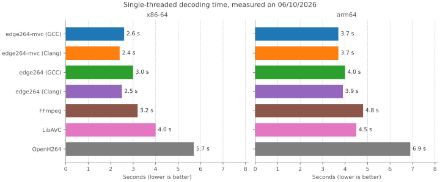
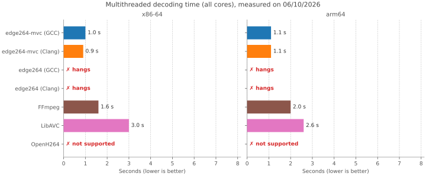

# edge264-mvc

edge264-mvc is an open-source software decoder for **H.264 MVC**, the stereoscopic 3D format of **3D Blu-ray** discs. It decodes both eye views of every picture and returns them as pairs, in display order. General-purpose decoders such as FFmpeg decode only the base view of these streams and drop the second eye, so edge264-mvc fills that gap. It also decodes ordinary 2D H.264 (High Profile).

edge264-mvc is derived from [edge264](https://github.com/tvlabs/edge264) by Thibault Raffaillac and is developed as an independent project. It is used by:
- **[Oku3D Media Player](https://oku3d.com/)** - a native 3D media player that plays 3D Blu-rays and converts any 2D video to stereoscopic 3D in real time.
- **[mvc-source](https://github.com/jens-duttke/mvc-source)** - an AviSynth+ and VapourSynth source plugin that frame-serves both MVC views for 3D video processing on Linux and Windows.

## Why edge264-mvc

- **3D Blu-ray decoding that works end to end** - both eye views of every picture, paired and in display order, tested on complete commercial 3D Blu-ray films.
- **Fast** - consecutive pictures are decoded in parallel on all cores, which makes 1080p decoding about 4 times as fast as on one core on an 8-core CPU. edge264's experimental multithreading hangs; on one core edge264-mvc is 3% to 24% faster than edge264, depending on CPU and compiler, and in our tests edge264 failed on 3D Blu-ray and 4K video.
- **Robust on damaged streams** - missing or damaged parts are concealed and decoding continues. The decoder is fuzzed under AddressSanitizer and UndefinedBehaviorSanitizer, and its threading is checked with ThreadSanitizer.
- **A small API that is hard to misuse** - send NAL units, receive frames; timestamps travel with their pictures, every frame reports whether part of it was concealed, and the results have the same values on every platform.
- **Tested on every change** - the output is compared with the ITU reference decoder on the conformance streams, on Linux and Windows, single- and multithreaded, and the decoder runs under the sanitizers and a fuzzer.

See [IMPROVEMENTS.md](IMPROVEMENTS.md) for everything that edge264-mvc changes over edge264.





*Decoding time of the [Big Buck Bunny test video](https://test-videos.co.uk/vids/bigbuckbunny/mp4/h264/1080/Big_Buck_Bunny_1080_10s_30MB.mp4) (1080p), the fastest of 10 runs on GitHub-hosted runners, once on one core and once with all cores. A red cross marks a decoder without a multithreaded result: OpenH264's decoder has no multithreading, and the experimental multithreading of the original edge264 (at a fixed commit) hangs on this video. The runners have only a few cores, so a many-core machine gains more from multithreading.*


## Supported streams and platforms

edge264-mvc decodes the **Progressive High** and **Stereo High** (MVC, 2 views) profiles of H.264 up to level 6.2, with 8-bit 4:2:0 video, which covers 3D Blu-ray and nearly all 2D H.264 in use. Interlaced coding, higher bit depths and 4:2:2 / 4:4:4 chroma are not supported - FFmpeg decodes those well.

It runs on **Linux** (x86-64 and ARM64) and **Windows** (x86-64), with runtime dispatch to the fastest x86-64 instruction set (see `VARIANTS` below). It is written in C with GCC / Clang vector extensions, and also builds for macOS and WebAssembly.


## Building

For native builds:

```sh
make
```

For WebAssembly builds:

```sh
emmake make # add CFLAGS=-mrelaxed-simd to target WASM v3
```

You can find lists of targets and options and what they do in the [Makefile](Makefile).

The `VARIANTS` option allows shipping multiple builds inside a single library file. It is intended for distribution packages that must run efficiently across a wide range of x86 CPUs: the library detects the host ISA level at runtime and dispatches to the fastest available implementation. They are *not* needed for a native single-machine build, where `-march=native` already picks the best code path at compile time. For example:

```sh
make CFLAGS="-march=x86-64" VARIANTS=x86-64-v2,x86-64-v3 BUILDTEST=no
```

### CMake integration

edge264-mvc ships a `CMakeLists.txt` that wraps its Makefile, so you can
integrate it into a CMake project without writing any custom build logic.
It exposes a single imported target `edge264mvc::edge264mvc` for use with
`target_link_libraries`.

```cmake
cmake_minimum_required(VERSION 3.14)
project(my_app C)

include(FetchContent)
FetchContent_Declare(edge264mvc
  GIT_REPOSITORY https://github.com/jens-duttke/edge264-mvc.git
  GIT_TAG        <tag>  # always pin to a tag or commit hash
)
FetchContent_MakeAvailable(edge264mvc)

add_executable(my_app main.c)
target_link_libraries(my_app PRIVATE edge264mvc::edge264mvc)
```


## Command-line tool

```sh
make
./edge264mvc_test --help # prints all options available
ffmpeg -i vid.mp4 -vcodec copy -bsf h264_mp4toannexb -an vid.264 # optional, converts from MP4 format
./edge264mvc_test -d vid.264 # replace -d with -b to benchmark instead of display
```

### Transcoding (piping decoded frames to an encoder)

`edge264mvc_test -o` writes the decoded frames to standard output as a self-describing [YUV4MPEG2 (Y4M)](https://wiki.multimedia.cx/index.php/YUV4MPEG2) stream (dimensions and frame rate in the header), so it pipes straight into any encoder. This is the practical way to re-encode a stream FFmpeg cannot decode - in particular an **MVC 3D Blu-ray**, whose dependent view FFmpeg drops:

```sh
# 2D: re-encode the base view
./edge264mvc_test movie.264 -o | ffmpeg -i - -c:v libx264 -crf 18 out.mp4

# 3D: -O writes the two views side by side (base | dependent) as one frame.
# There is no open MVC encoder, so a frame-compatible side-by-side H.264 (playable
# on any 3D display) is the realistic single-file 3D output; frame-packing=3 tags it.
./edge264mvc_test movie.264 -O | ffmpeg -i - -c:v libx264 -crf 18 -x264opts frame-packing=3 out_sbs3d.mp4
```

Real 3D Blu-rays carry per-access-unit unspecified NALs (type 24) that the decoder reports as unsupported; add `-k` so the decode runs to the end instead of stopping at the first one (`-ok` / `-Ok`). The frame rate is taken from the stream's VUI and can be overridden downstream (`ffmpeg -r ...`).

The input path can also be `-` to read an Annex B stream from standard input, so a demuxer can pipe straight into the decoder without a temporary file (`demux ... | edge264mvc_test - -O | ffmpeg -i - ...`); on POSIX a named pipe (FIFO) path works the same way. Stream input is buffered one NAL unit at a time (capped at 64 MiB), while regular files stay on the memory-mapped fast path.


## Using the library

Here is a complete example that opens an input file in Annex B byte stream format from the command line, and writes its decoded frames (base view) in planar YUV order to standard output. See [edge264mvc_test.c](src/edge264mvc_test.c) for a more complete example which can also display frames.

```c
#include <fcntl.h>
#include <unistd.h>
#include <sys/mman.h>
#include <sys/stat.h>

#include "edge264mvc.h"

static void write_frames(Edge264MvcDecoder *dec) {
	Edge264MvcFrame frm;
	while (edge264mvc_receive_frame(dec, &frm) == EDGE264MVC_OK) {
		for (int y = 0; y < frm.height_Y; y++)
			write(1, frm.views[0].planes[0] + y * frm.stride_Y, frm.width_Y);
		for (int p = 1; p < 3; p++)
			for (int y = 0; y < frm.height_C; y++)
				write(1, frm.views[0].planes[p] + y * frm.stride_C, frm.width_C);
		edge264mvc_release_frame(dec, &frm);
	}
}

int main(int argc, char *argv[]) {
	int fd = open(argv[1], O_RDONLY);
	struct stat st;
	fstat(fd, &st);
	const uint8_t *buf = mmap(NULL, st.st_size, PROT_READ, MAP_SHARED, fd, 0);
	size_t size = st.st_size;
	Edge264MvcDecoder *dec;
	edge264mvc_open(&dec, NULL); // default settings: one thread per CPU, no trace
	size_t pos = edge264mvc_find_start_code(buf, size);
	while (pos < size) {
		size_t start = pos + 3; // skip the 00 00 01 start code
		size_t next = start + edge264mvc_find_start_code(buf + start, size - start);
		// AGAIN means: receive the ready frames, then send the same NAL again
		while (edge264mvc_send_nal(dec, buf + start, next - start, 0, 0) == EDGE264MVC_AGAIN)
			write_frames(dec);
		write_frames(dec);
		pos = next;
	}
	edge264mvc_send_end(dec);
	write_frames(dec);
	edge264mvc_close(&dec);
	munmap((void *)buf, size);
	close(fd);
	return 0;
}
```


## API reference

The whole API is declared in [edge264mvc.h](edge264mvc.h), and the library is called `edge264mvc` (`libedge264mvc.so.2`, `edge264mvc.2.dll`). Call the functions of one decoder from one thread at a time; different decoders can run in different threads at the same time. Every function returns one of these results, which have the same values on every platform:

| Result | Meaning |
|---|---|
| `EDGE264MVC_OK` (0) | success |
| `EDGE264MVC_AGAIN` (-1) | `send_nal`: the decoder is full - receive the ready frames, then send the same NAL again (every such round makes progress: a frame comes out, or a picture that can never be output, such as an MVC dependent view whose base view is missing, is dropped). `receive_frame`: no frame is ready, send more NALs. |
| `EDGE264MVC_END` (-2) | `receive_frame`: every frame was returned after `send_end` |
| `EDGE264MVC_UNSUPPORTED` (-3) | the NAL uses a type or feature the decoder does not support (e.g. the unspecified NAL types 0 and 24-31 of some 3D Blu-rays, interlaced coding, or a frame larger than `max_frame_pixels`); it was skipped, send the next one |
| `EDGE264MVC_CORRUPT` (-4) | the NAL is damaged; it was skipped and the pictures it belonged to are concealed, send the next one |
| `EDGE264MVC_NOMEM` (-5) | memory allocation failed; the NAL may be sent again |
| `EDGE264MVC_INVALID` (-6) | an argument is invalid |

<code>uint32_t <b>edge264mvc_api_version</b>(void)</code> and <code>const char * <b>edge264mvc_version</b>(void)</code>

> The API version of the loaded library, as `major << 16 | minor << 8 | patch` (compare with `EDGE264MVC_API_VERSION` from the header), and its release as text.

<code>void <b>edge264mvc_default_settings</b>(settings)</code>

> Fill an `Edge264MvcSettings` with the defaults. Always call it before changing a field, so that a field added later keeps its default.
> * `int32_t n_threads` - 0 (default): one worker thread per logical CPU available to the process; 1: decode synchronously inside `send_nal`, on the calling thread; N > 1: N worker threads (at most 128 are used)
> * `int32_t max_frame_pixels` - frames larger than this (in luma pixels, after cropping, so 1920x1080 for 1080p video) are reported as unsupported, as is a stream whose coded frame exceeds it by more than rounding each dimension up to a multiple of 16; 0 (default): 8192x4352, the largest frame any level of H.264 allows
> * `void (* log_cb)(const char * line, void * log_arg)` - if not NULL, receives a YAML trace of every header (and macroblock with `log_mbs`), possibly from worker threads; requires the `logs` build variant, without which `edge264mvc_open` returns `EDGE264MVC_INVALID`
> * `void * log_arg` - passed to `log_cb`
> * `int32_t log_mbs` - 1 to include every macroblock in the trace

<code>int <b>edge264mvc_open</b>(decoder, settings)</code>

> Allocate a decoder with the given settings (NULL for the defaults) into `*decoder`. Returns `EDGE264MVC_OK`, `EDGE264MVC_NOMEM` or `EDGE264MVC_INVALID`.

<code>int <b>edge264mvc_send_nal</b>(decoder, nal, size, pts, user_data)</code>

> Send one NAL unit, without its 00 00 01 start code. The bytes are copied (or decoded) before the function returns, so the buffer can be reused at once. `pts` and `user_data` are passed through to the views of the picture this NAL starts, so a player keeps its timestamps attached to its frames. Returns `EDGE264MVC_OK`, `EDGE264MVC_AGAIN`, `EDGE264MVC_UNSUPPORTED`, `EDGE264MVC_CORRUPT`, `EDGE264MVC_NOMEM` or `EDGE264MVC_INVALID`.

<code>int <b>edge264mvc_send_end</b>(decoder)</code>

> Signal the end of the stream: `receive_frame` then returns every frame still held, and `EDGE264MVC_END` afterwards. Sending a NAL afterwards starts a new stream.

<code>int <b>edge264mvc_receive_frame</b>(decoder, frame)</code>

> Return the next frame in display order. After `send_nal` returned `EDGE264MVC_AGAIN`, or after `send_end`, it waits for the worker threads to finish the frames that are due instead of returning `EDGE264MVC_AGAIN` at once. For MVC streams a frame carries both views of one access unit, paired by picture order count.
>
> ```c
> typedef struct Edge264MvcView {
> 	const uint8_t *planes[3]; // Y, Cb, Cr, already cropped; NULL in a frame without this view
> 	int64_t pts; // values given to send_nal with the first NAL of this picture
> 	int64_t user_data;
> 	int64_t display_order; // strictly increasing in output order, per view
> 	int32_t poc; // picture order count as coded, reset by every IDR
> 	int32_t decode_order; // increasing in decoding order, per decoder
> 	uint32_t flags; // EDGE264MVC_VIEW_CONCEALED (part of the picture was missing or damaged and was concealed), EDGE264MVC_VIEW_IDR
> 	uint32_t reserved;
> } Edge264MvcView;
>
> typedef struct Edge264MvcFrame {
> 	Edge264MvcView views[2]; // [0]: base view, [1]: dependent view (MVC)
> 	int32_t width_Y, height_Y, width_C, height_C; // after cropping
> 	int32_t stride_Y, stride_C; // in bytes, between rows of a plane
> 	int32_t bit_depth_Y, bit_depth_C;
> 	int32_t crop[4]; // pixels removed from the coded picture {top, right, bottom, left}
> 	void *handle; // internal
> 	uint8_t reserved[32];
> } Edge264MvcFrame;
> ```

<code>void <b>edge264mvc_release_frame</b>(decoder, frame)</code>

> Give a received frame back to the decoder, which may then reuse its memory. Every received frame must be released, and frames held by the caller limit how far the decoder can run ahead.

<code>void <b>edge264mvc_flush</b>(decoder)</code>

> Discard every picture and the decoding state, e.g. to seek. Decoding resumes at the next IDR picture or recovery point. Frames already received stay valid until released.

<code>void <b>edge264mvc_close</b>(decoder)</code>

> Stop the worker threads, free the decoder including the frames not released yet, and set `*decoder` to NULL. Accepts NULL.

<code>size_t <b>edge264mvc_find_start_code</b>(buf, size)</code>

> Return the offset of the first 00 00 01 start code in `buf[0..size)`, or `size` if there is none. Reads only inside the buffer.


## Tests

`make check` builds the decoder and runs the whole test suite offline:

- **Conformance** ([`tests/conformance`](tests/conformance)) - decodes a selection of the ITU conformance streams and compares the output of each view with a hash of the ITU reference output, together with the MVC guarantees (views paired, display order).
- **Liveness** ([`tests/liveness`](tests/liveness)) - decodes damaged real-world streams (truncated captures, dropped or damaged NAL units) and asserts that the decoder always makes progress.
- **Robustness** ([`tests/asan`](tests/asan)) - crafted streams found by fuzzing, decoded single-threaded and with four threads (`make SANITIZE=address check-asan` runs them under AddressSanitizer).
- **Multithreading** - every conformance and liveness stream is also decoded with worker threads and must give the same output as single-threaded decoding.
- **Trace** - the conformance streams are decoded once more with the header trace on, which must not change the output.
- **API contract** ([`tests/api_check.c`](tests/api_check.c)) - the promises of the API itself: version and defaults, the results for invalid arguments, the end of a stream, a flush after the end followed by the same stream again, timestamps passed through to their frames, and a caller that holds its latest frame through an end of sequence and a change of the frame size.
- **Several decoders** ([`tests/multi_decoder_check.c`](tests/multi_decoder_check.c)) - decoders in several threads at the same time, single-threaded and with worker threads, checked under ThreadSanitizer in CI.
- **Partial receiving** ([`tests/partial_receive_check.c`](tests/partial_receive_check.c)) - a caller that receives one frame at a time and holds a few, on a damaged MVC stream that fills the decoder: no held frame may change, and no picture may come out twice.
- **Allocation failing** ([`tests/alloc_failure_check.c`](tests/alloc_failure_check.c)) - decoding when the memory for a new picture cannot be allocated, which must be reported as such and never leave a caller waiting for frames that do not come (Linux).
- **Thread creation failing** ([`tests/open_failure_check.c`](tests/open_failure_check.c)) - opening a decoder when creating one of its worker threads fails, which must fail cleanly and leave no thread behind (Linux).
- **Overlapping slices** ([`tests/slice_overrun_check.c`](tests/slice_overrun_check.c)) - slices that a worker thread decodes past the start of the next slice before it arrives, which must give the single-threaded output, checked under ThreadSanitizer in CI.

On the full set of 231 AVC, FRExt and MVC [conformance streams](https://www.itu.int/wftp3/av-arch/jvt-site/draft_conformance/), edge264-mvc decodes 113 exactly like the ITU reference decoder, 117 use features outside the supported profiles (and are reported as unsupported), and 1 differs. CI additionally runs the tests on Windows, under the sanitizers, and fuzzes the decoder with libFuzzer ([`tests/fuzz_decode.c`](tests/fuzz_decode.c), `make fuzz`).

`edge264mvc_test` can also decode every `<video>.264` file of a directory and compare every sample of its output with a sibling `<video>.yuv` ([`tests/edge264mvc_test_yuv_check.py`](tests/edge264mvc_test_yuv_check.py) checks that it does). The planned synthetic tests are listed in [tests/ROADMAP.md](tests/ROADMAP.md).


## Relation to edge264

edge264 is a research decoder that explores new techniques for fast and compact decoders, most notably C vector extensions in place of hand-written assembly ([DESIGN.md](DESIGN.md) describes them, and they still shape this code). edge264-mvc started as a fork to make its MVC path work for 3D Blu-ray playback, and has since added multithreaded decoding, many fixes for real-world and damaged streams, speed-ups and its own API ([IMPROVEMENTS.md](IMPROVEMENTS.md)). The two projects are developed independently.

Thanks to Thibault Raffaillac (tvlabs) for edge264, to [@intrepidsilence](https://github.com/intrepidsilence) and [@vkapartzianis](https://github.com/vkapartzianis) for the edge264 patches this project builds on, and to [@cbusillo](https://github.com/cbusillo) for contributions to edge264-mvc.


## Contributing

Bug reports, fixes and new tests are welcome. A fix should come with a test stream that shows the problem; these are added to the test suite after stripping most of the image content. See the [tests](tests/) directory for examples.


## License

edge264-mvc is distributed under the [BSD 3-Clause license](LICENSE_BSD.txt).
